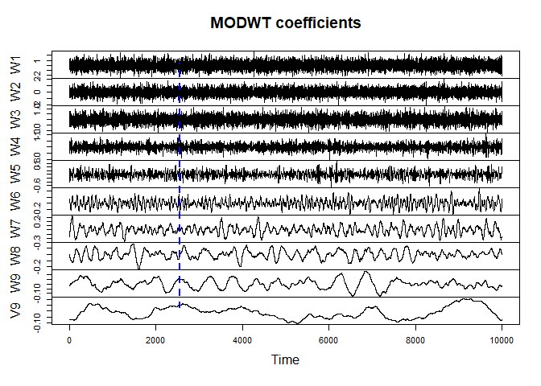

<!-- README.md is generated from README.Rmd. Please edit that file -->

# fastWavelets 

<!-- badges: start -->
<!-- badges: end -->

A lightweight R package for computing the Maximal Overlap Discrete
Wavelet Transform (MODWT) and À Trous DWT. This package was originally
developed to aid forecasting research in water resources (streamflow
forecasting, urban water demand forecasting, etc.)

## Installation

You can install the latest version of fastWavelets with

``` r
install.packages("fastWavelets")
```

You can also install the development version of fastWavelets from
[GitHub](https://github.com/) with:

``` r
# install.packages("devtools")
devtools::install_github("johnswyou/fastWavelets")
```

## Example

Here we decompose a white noise series using MODWT:

``` r
library(fastWavelets)

set.seed(839)                       # make this example reproducible

N <- 1000                           # number of time series points
J <- 4                              # decomposition level
wavelet <- 'coif1'                  # scaling filter
X <- matrix(rnorm(N),N,1)           # white noise
modwt.X <- mo_dwt(X,wavelet,J)
colnames(modwt.X) <- c(paste0("W", 1:J), paste0("V", J))
nbc <- n_boundary_coefs(wavelet, J) # number of boundary affected coefficients

# Visualizations
plot.ts(X, main = "White noise series", ylab="")
```


``` r
plot.ts(modwt.X, nc=1, main="MODWT coefficients")
abline(v=nbc, lwd=2, col="blue", lty=2)
```



In the context of forecasting, everything to the left of the vertical
dashed blue line would be removed prior to training a forecasting model
using the MODWT coefficients. It is often useful to view wavelet
decomposition methods such as the MODWT as a “feature generation” or
“feature engineering” method.

## Available scaling filters

For `atrous_dwt`, the set of possible values for the argument `wavelet`
is as follows:

``` r
c("haar", "d1", "sym1", "bior1.1", "rbio1.1",
"d2", "sym2", "d3", "sym3", "d4", "d5", "d6", "d7", "d8", "d9", "d10", "d11",
"sym4", "sym5", "sym6", "sym7", "sym8", "sym9", "sym10",
"coif1", "coif2", "coif3", "coif4", "coif5",
"bior1.3", "bior1.5", "bior2.2", "bior2.4", "bior2.6", "bior2.8", "bior3.1", "bior3.3",
"bior3.5", "bior3.7", "bior3.9", "bior4.4", "bior5.5", "bior6.8",
"rbio1.3", "rbio1.5", "rbio2.2", "rbio2.4", "rbio2.6", "rbio2.8", "rbio3.1", "rbio3.3",
"rbio3.5", "rbio3.7", "rbio3.9", "rbio4.4", "rbio5.5", "rbio6.8",
"la8", "la10", "la12", "la14", "la16", "la18", "la20",
"bl14", "bl18", "bl20",
"fk4", "fk6", "fk8", "fk14", "fk18", "fk22",
"b3spline", 
"mb4.2", "mb8.2", "mb8.3", "mb8.4", "mb10.3", "mb12.3", "mb14.3", "mb16.3", "mb18.3", "mb24.3", "mb32.3", 
"beyl", 
"vaid", 
"han2.3", "han3.3", "han4.5", "han5.5")
```

and for `mo_dwt`, the set of possible values for `wavelet` is

``` r
c("haar", "d1", "sym1",
"d2", "sym2", "d3", "sym3", "d4", "d5", "d6", "d7", "d8", "d9", "d10", "d11",
"sym4", "sym5", "sym6", "sym7", "sym8", "sym9", "sym10",
"coif1", "coif2", "coif3", "coif4", "coif5",
"la8", "la10", "la12", "la14", "la16", "la18", "la20",
"bl14", "bl18", "bl20",
"fk4", "fk6", "fk8", "fk14", "fk18", "fk22",
"mb4.2", "mb8.2", "mb8.3", "mb8.4", "mb10.3", "mb12.3", "mb14.3", "mb16.3", "mb18.3", "mb24.3", "mb32.3", 
"beyl", 
"vaid", 
"han2.3", "han3.3", "han4.5", "han5.5")
```

## References

Quilty, J., & Adamowski, J. (2018). Addressing the incorrect usage of
wavelet-based hydrological and water resources forecasting models for
real-world applications with best practices and a new forecasting
framework. Journal of Hydrology, 563, 336–353.
<https://doi.org/10.1016/j.jhydrol.2018.05.003>

Bašta, M. (2014). Additive decomposition and boundary conditions in
wavelet-based forecasting approaches. Acta Oeconomica Pragensia, 22(2),
48–70. <https://doi.org/10.18267/j.aop.431>

Benaouda, D., Murtagh, F., Starck, J.-L., & Renaud, O. (2006).
Wavelet-based nonlinear multiscale decomposition model for electricity
load forecasting. Neurocomputing, 70(1-3), 139–154.
<https://doi.org/10.1016/j.neucom.2006.04.005>

Maheswaran, R., & Khosa, R. (2012). Comparative study of different
wavelets for hydrologic forecasting. Computers & Geosciences, 46,
284–295. <https://doi.org/10.1016/j.cageo.2011.12.015>
